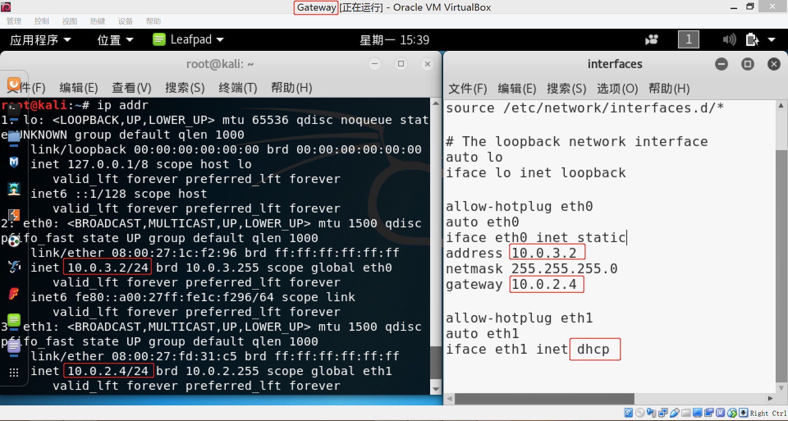

#### chap0x01 

---

**实验内容：基于VirtualBox的网络攻防基础环境搭建实例讲解**

* 节点：靶机、网关、攻击者主机
* 连通性
* 靶机可以直接访问攻击者主机
* 攻击者主机无法直接访问靶机
* 网关可以直接访问攻击者主机和靶机
* 靶机的所有对外上下行流量必须经过网关
* 所有节点均可以访问互联网
* 其他要求
* 所有节点制作成基础镜像（多重加载的虚拟硬盘）

、、、、、、、、、、、、、、、、、、、、、、、、、、、、、、、、、

**思路**：将靶机和网关放在一个网段，攻击者放在另一个网段。

、、、、、、、、、、、、、、、、、、、、、、、、、、、、、、、、、

**网络拓扑**：

、、、、、、、、、、、、、、、、、、、、、、、、、、、、、、、、、

**尝试**：原本打算将 **靶机** 和 **网关** 使用 Host-Only 网络分配到同一个网段。

配置新网卡。网卡信息：

将 **Victim** 网卡选择为 Adapter #2 , 开机启动，报错，错误信息如下：

**尝试了 Google 上的大部分看似靠谱的解决方法，依然没有解决。**

、、、、、、、、、、、、、、、、、、、、、、、、、、、、、、、、、

**实验**：电脑配置的网卡不能正常启动，所以一直没有思路。上课时听说可以使用 **内网模式** , 故尝试使用 内网 模式。

、、、

网段：10.0.2.0 （NAT 网段，攻击者主机网卡 和 网关的一块网卡所在网段）

网段：10.0.3.0（内网网段，靶机网卡 和 网关的另一张网卡所在网段）

、、、

设置镜像为多重加载：

**配置网络环境:**

1）.**网关（gateway）**

虚拟机内部配置：

虚拟机外部配置：

2）.**攻击者主机（attacker）**

虚拟机内部配置：

虚拟机外部配置：

3）.**靶机（victim）**

虚拟机内部配置：

虚拟机外部配置：

**连通性测试**：

**注：以上的网络环境虽然搭建完成，但 `网关（gateway）` 并不具有转发数据包的功能，i.e. 内网的网卡接收的数据包，并不能转发给 NAT 网络的网卡。因此需要配置 iptables 规则。**

1）. 网关（gateway）的 **iptables** 配置：

2）.  网关（gateway）ping 指令测试

3）. 靶机（victim）ping 指令测试

4）. 攻击者（attacker）ping 指令测试

5）. 网关流量监控（不知道 reply 数据包算不算是下行流量......）

